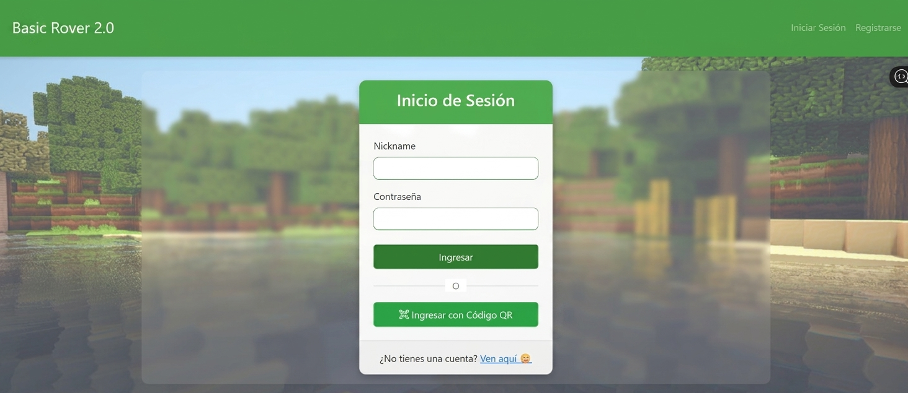
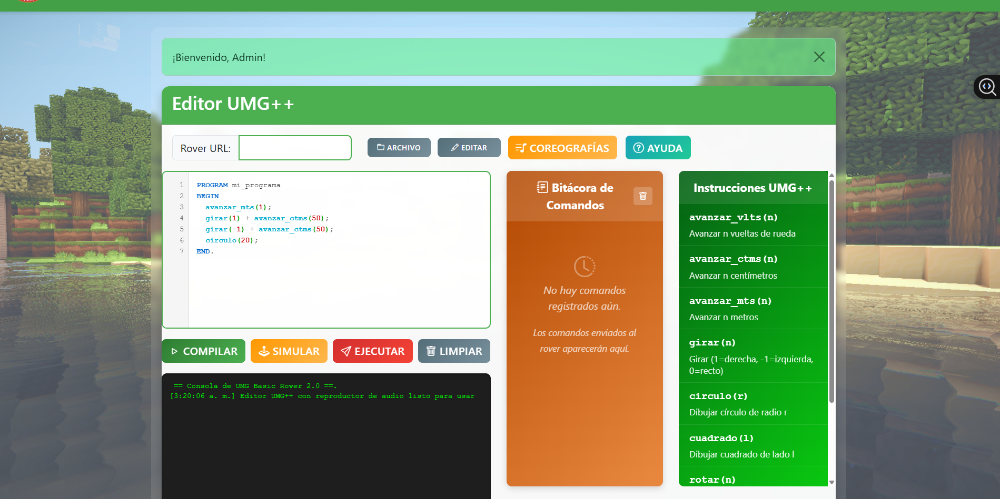
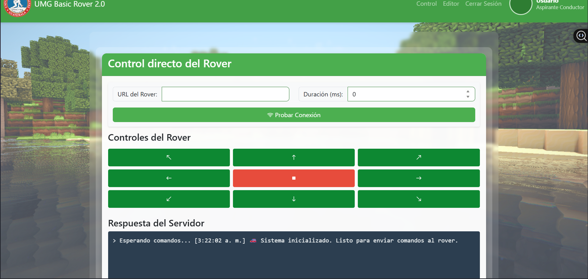
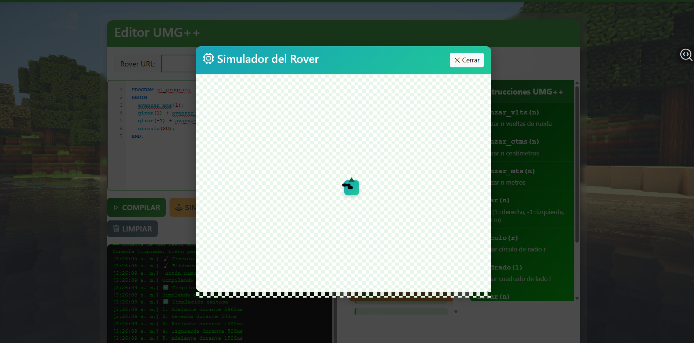

<h1 align="center"> IoT Rover Control System</h1>

<b>Full-stack IoT platform for real-time hardware control with web backend, HTTP communication, and command transpiler.</b>

---

##  Demo

Real demonstration of the system in operation. It shows the execution of commands sent from the web interface to the rover.

https://youtube.com/shorts/yoT20DtxeRs

---

##  Description

This project is an IoT platform that integrates a web application with physical hardware to enable real-time remote control of a rover.

The system allows commands to be sent from a web interface developed with Django. These commands are processed by the backend and transmitted via HTTP requests to an ESP8266 microcontroller, which executes the rover’s movements.

Additionally, the system incorporates a command transpiler that translates high-level instructions into executable commands, enabling automation and programmable movement sequences.

The solution demonstrates a complete integration between backend development, networking, communication protocols, and embedded hardware, simulating a real-world IoT and remote control environment.

This project stands out for its practical approach to connecting software with physical devices, addressing real challenges such as communication, latency, and real-time control.

---

##  Project Screenshots

###  Login with QR Authentication

  

Secure authentication system with QR-based access, allowing users to log in and interact with the platform in a controlled environment.

---

###  Main Control Panel

  

Main interface used to control the rover in real time.

---

###  HTTP Communication Testing

  

Testing area used to validate communication between the web system and the hardware.

---

###  Movement Simulation

  

Simulation of the rover's behavior to verify command execution before real deployment.

---

##  Command Transpiler

The system includes a custom transpiler that converts high-level instructions into executable commands for the rover, enabling automation and programmable control of movements.

---

##  Technologies Used

- Python / Django (Backend)
- HTML, CSS, JavaScript (Frontend)
- ESP8266 (Embedded hardware)
- ngrok (HTTP tunneling for remote access)
- MySQL / SQL Server (Databases)
- Real-time HTTP communication
- Command transpiler design

---

##  System Architecture

Web Client → Django Backend → HTTP Requests → ESP8266 → Rover

---

##  Problem Solved

This project addresses the challenge of integrating web applications with physical devices, enabling real-time remote control and automation in IoT environments.

---
## 🔑 Authentication System

The platform includes a secure authentication system that generates QR codes for user access. This allows controlled entry into the system and demonstrates the implementation of secure access mechanisms in a real-world environment.

This feature enhances the system by integrating identity validation with IoT interaction.

##  Project Impact

- Real integration between software and hardware  
- Automation of movements through programmable logic  
- Simulation of IoT systems applicable to industry and robotics  
- Solving challenges related to remote communication and real-time control  
